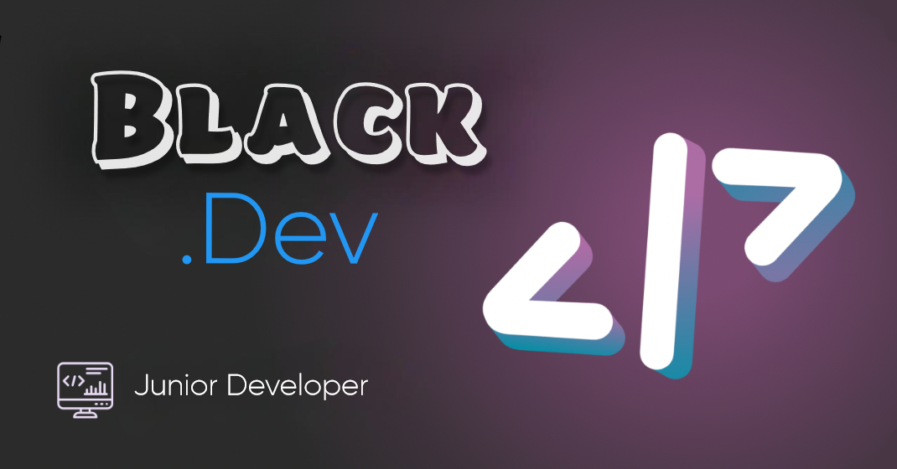

  

 <h1 align="center"> 🛠 Language & Tools </h1> 

  
  
  
  
  
  
  
  

 <h1 align="center"> 👋 About Me </h1> 

 <h3 align="center"> 
Hello, I'm Adham!
I Speak Arabic, English

  📜 Frntend | 💻 Backend 

</h3>

 <h1 align="center"> 🔗 Social Links </h1> 

  
  
  

 <h1 align="center"> 😎 Noteable Projects </h1> 

  
  

 <h1 align="center"> 📊 GitHub Statistics </h1> 

  

